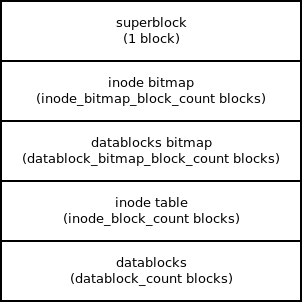

<!--
Comments...
-->


# TP Docker basics

## Introduction

Le but de ce travail pratique est de se familiariser avec les manipulations de base des containers Docker et d'en comprendre le fonctionnement.

Le premier travail est réalisé est décrit à la section [ici](#exercice-1)

## Préparation

Sur la même machine hôte que celle utilisée lors des travaux pratiques précédents, installez le package nécessaire à l'utilisation des containers Docker. Pour rappel `apt-cache search` permet de réaliser une recherche par mot-clés dans la repository Ubuntu/Debian.
Il est très fortement recommandé d'utiliser Docker avec votre utilisateur normal (pas root/sudo). Pour cela assurez-vous que votre utilisateur appartient au groupe docker. La commande `groups` permet d'afficher les groupes auquel appartient l'utilisateur courant. Pour ajouter un utilisateur à un ou plusieurs groupes, utilisez la commande `usermod`. Ensuite, reconnectez-vous pour que l'appartenance au groupe soit effective.
Enfin, assurez-vous que le service docker soit démarré au démarrage de la machine avec `systemctl enable docker` (en tant que root). Le service docker peut aussi être démarré/arrêté avec `systemctl start/stop docker`.

\begin{comment}
\begin{lstlisting}[language=bash,style=solutions]
sudo apt install docker.io
sudo usermod -a -G docker student
su student
groups -> permet de vérifier l'appartenance au groupe docker
sudo systemctl enable docker
sudo systemctl start docker
\end{lstlisting}
\end{comment}

Comme Docker nécessite potentiellement plusieurs GB de libre dans `/var/lib/docker`, assurez-vous que vous avez suffisamment d'espace à cet endroit (d'où la nécessité d'avoir réservé la moitié de votre volume groupe avec LVM lors du dernier TP QEMU/LVM).

Docker télécharge les images sur un registry via le protocole https. Sur la machine qui vous est fournie, le traffic https passe par un proxy de l'école. Voici les étapes à effectuer (en root) pour que Docker utilise le proxy de l'école (via systemd) :

```
# Créez le répertoire suivant :
$ sudo mkdir -p /etc/systemd/system/docker.service.d

# Dedans, créez le fichier `http-proxy.conf` avec le contenu :
[Service]
...
```

## Format du système de fichiers

Le système de fichiers implémenté est basé sur une allocation des blocs de données indexées avec des pointeurs directs et indirects. Chaque fichier est associé à un inode qui contient les méta-données de celui-ci. Un bitmap d’inodes est utilisé afin de déterminer quels sont les inodes libres ou alloués. Similairement, un bitmap est utilisé pour déterminer les blocs de données libres ou alloués. Pour des raisons de simplicité, la notion de répertoire est inexistante et le nom de fichier est stoqué dans l'inode. Ainsi, le système de fichiers n’est pas hiérarchique et tous les fichiers sont stoqués "à plat".

La structure du système de fichiers sur disque est illustrée en Figure \ref{my_fig}.

{ width=40% }

La structure du superblock est la suivante :

\small
```
typedef struct __attribute__ ((__packed__)) {
	int8_t   signature[4];           // BFS followed by end of string (0)
	uint8_t  version_major;          // 1 for now
	uint8_t  version_minor;          // 0 for now
	int8_t   label[32];              // includes the end of string (0)
	uint32_t block_size;             // block size in bytes	
	uint32_t inode_bitmap_start;     // at which block the inode bitmap starts
	uint32_t inode_bitmap_block_count;  // #blocks for the inode bitmap
	uint32_t datablock_bitmap_start; // at which block the block bitmap starts
	uint32_t datablock_bitmap_block_count;  // #blocks for the block bitmap
	uint32_t inode_start;           // at which block the inode table starts
	uint32_t inode_count;           // inode count (1 inode = 64 bytes)
	uint32_t inode_block_count;     // #blocks for the inode table
	uint32_t datablocks_start;      // at which block the data blocks start
	uint32_t datablock_count;       // #data blocks
} superblock_t;
```
\normalsize

Bien que le contenu du superblock soit au maximum de 512 bytes (la taille d’un secteur), il occupe physiquement un bloc sur le disque (le contenu du bloc qui suit la structure `superblock_t` est "paddée" de zéros). Ceci est volontaire, car ainsi le disque complet est divisé en blocs - que cela soit le superblock, les bitmaps, la table des inodes ou encore les blocs de données.

## Exercice 1

Une série d'exercices se trouvent sur ...

\begin{comment}
\begin{lstlisting}[language=bash,style=solutions]
blah blah blah
blah blah blah
blah blah blah
blah blah blah
\end{lstlisting}
\end{comment}

Déterminez l'image du premier exercice...

### \color{red}{Ce travail est à rendre sur Cyberlearn pour le jeudi 1er avril à 23h59 !}
